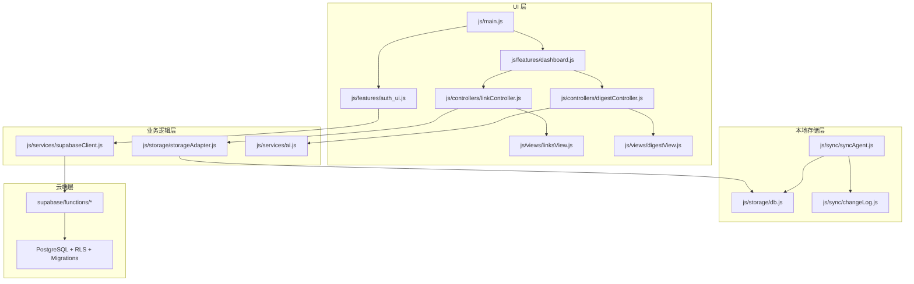

# 项目代码模块清单 (Code Module Blueprint)

版本: v1.0  
生成时间: 2025-12-02  
架构原则: 单一职责 (SRP)、Local-First、五行架构（UI/业务/同步/存储/云端）

本文档列出当前项目的核心模块，包含文件命名、所在目录、模块职责、主要输入输出与依赖关系；明确区分前端 UI、业务逻辑、Supabase API、同步系统、符文系统（规划）等。

---

## 1. 前端入口与平台

- 模块: `js/main.js`
  - 目录: `js/`
  - 职责: 应用启动器；初始化 Service Worker、Auth UI、Dashboard；统一生命周期与全局事件
  - 输入: `window.load`、本地用户状态
  - 输出: 初始化完成、页面渲染触发
  - 依赖: `features/auth_ui.js`、`features/dashboard.js`、`storage/storageAdapter.js`

- 模块: `sw.js`
  - 目录: 项目根目录
  - 职责: PWA Service Worker；离线缓存 App Shell 与核心静态资源；升级与缓存清理
  - 输入: 浏览器 `install/activate/fetch` 事件
  - 输出: 缓存命中响应、离线可用页面
  - 依赖: 浏览器 CacheStorage、资源列表

- 模块: `manifest.json`
  - 目录: 项目根目录
  - 职责: PWA 清单；配置图标、名称、主题色；供浏览器安装入口识别
  - 输入: 浏览器安装流程
  - 输出: 安装元数据（图标、名称等）
  - 依赖: `/assets/icons/`

- 页面文档: `index.html` / `dashboard.html` / `signup.html`
  - 目录: 项目根目录
  - 职责: 页面骨架；引入脚本与样式；加载 Supabase SDK / Manifest / 入口脚本
  - 输入: 浏览器加载
  - 输出: 初始 DOM、脚本加载
  - 依赖: CDN（字体与 Supabase SDK）、`js/main.js`

---

## 2. 前端 UI 层 (Views / Components / Templates)

- 模块: `js/views/linksView.js`
  - 目录: `js/views/`
  - 职责: 书签列表视图；虚拟滚动、卡片渲染、事件代理
  - 输入: 链接列表数据（数组）
  - 输出: DOM 更新、用户交互事件
  - 依赖: `templates/card.js`、`utils/dom.js`

- 模块: `js/views/digestView.js`
  - 目录: `js/views/`
  - 职责: 摘要视图；渲染 digest 卡片与交互行为
  - 输入: 摘要数据
  - 输出: DOM 更新
  - 依赖: `templates/digestCard.js`

- 模块: `js/components/*`
  - 目录: `js/components/`
  - 职责: 独立 UI 组件（`settings-panel.js`、`user-dropdown.js`、`profile-form.js`、`user-welcome-card.js`、`modal-digest.js` 等）
  - 输入: 组件属性 (props)
  - 输出: 组件 DOM
  - 依赖: `utils/ui-helpers.js`

- 模板函数: `js/templates/card.js` / `js/templates/digestCard.js`
  - 目录: `js/templates/`
  - 职责: 纯模板函数；返回 HTML 字符串
  - 输入: 数据对象
  - 输出: HTML 字符串
  - 依赖: 无

---

## 3. 业务逻辑层 (Features / Controllers)

- 模块: `js/features/auth_ui.js`
  - 目录: `js/features/`
  - 职责: 认证 UI 逻辑；登录/注册提交、Auth 状态监听；登录后触发同步
  - 输入: 表单数据、`supabase.auth` 状态事件
  - 输出: 本地用户状态、跳转与同步触发
  - 依赖: `services/supabaseClient.js`、`utils/ui-helpers.js`、`controllers/linkController.js`

- 模块: `js/features/dashboard.js`
  - 目录: `js/features/`
  - 职责: 仪表盘编排；协调控制器与视图，组织页面渲染流程
  - 输入: 当前用户、存储数据
  - 输出: 完整页面 UI
  - 依赖: `controllers/*`、`views/*`

- 模块: `js/controllers/linkController.js`
  - 目录: `js/controllers/`
  - 职责: 链接控制器；处理书签 CRUD，协调存储与视图更新，登录后执行本地数据合并/迁移
  - 输入: 用户操作事件
  - 输出: 持久化后的书签数据、视图刷新
  - 依赖: `storage/storageAdapter.js`、`views/linksView.js`

- 模块: `js/controllers/digestController.js`
  - 目录: `js/controllers/`
  - 职责: 摘要控制器；调用 AI 服务生成摘要，持久化并渲染
  - 输入: 链接数据、AI 配置
  - 输出: 摘要结果与视图更新
  - 依赖: `services/ai.js`、`views/digestView.js`

---

## 4. 同步系统 (Sync Engine)

- 模块: `js/sync/syncAgent.js`
  - 目录: `js/sync/`
  - 职责: 同步代理；管理 Push/Pull 循环、批量提交变更；处理服务端 `merged_record`；非阻断冲突提示
  - 输入: 本地变更、网络状态
  - 输出: 同步状态、合并结果本地落盘
  - 依赖: `sync/changeLog.js`、`services/supabaseClient.js`、`utils/ui-helpers.js`、`storage/db.js`

- 模块: `js/sync/changeLog.js`
  - 目录: `js/sync/`
  - 职责: 客户端变更日志；生成 `client_change` 记录与 `field_timestamps`（字段级时间戳）
  - 输入: 用户 CRUD 操作
  - 输出: 变更记录 (IndexedDB)
  - 依赖: `storage/db.js`

- 模块: `js/sync/idMapping.js`
  - 目录: `js/sync/`
  - 职责: 本地与服务端 ID 映射；新建后将 `local_id` 映射为 `server_id`
  - 输入: 服务端返回的映射信息
  - 输出: 本地映射表
  - 依赖: `storage/db.js`

- 模块: `js/sync/migrate.js`
  - 目录: `js/sync/`
  - 职责: 本地数据迁移；历史版本到当前 Schema 的升级
  - 输入: 老版本数据
  - 输出: 新版本数据结构
  - 依赖: `storage/db.js`

- 模块: `js/sync/conflict.js`
  - 目录: `js/sync/`
  - 职责: 冲突策略库（当前采用自动合并 + 备份审计）；可扩展冲突分析工具
  - 输入: 冲突字段与快照
  - 输出: 审计记录（本地）或策略决策
  - 依赖: `storage/db.js`

---

## 5. 存储层 (Local Storage)

- 模块: `js/storage/db.js`
  - 目录: `js/storage/`
  - 职责: IndexedDB 初始化与 Schema 定义（websites、client_changes_local、conflict_backups、deletion_backups 等）
  - 输入: 数据库版本变化
  - 输出: 可用的数据库实例
  - 依赖: Dexie 或原生 IndexedDB API

- 模块: `js/storage/storageAdapter.js`
  - 目录: `js/storage/`
  - 职责: 存储适配器；统一 CRUD 接口；屏蔽底层表结构差异
  - 输入: 业务实体数据
  - 输出: 持久化结果
  - 依赖: `db.js`

---

## 6. 服务层 (Services)

- 模块: `js/services/supabaseClient.js`
  - 目录: `js/services/`
  - 职责: Supabase 客户端封装；SDK 初始化与 Session 管理；统一 RPC/REST 调用
  - 输入: 环境配置 (`VITE_SUPABASE_URL`、`VITE_SUPABASE_ANON_KEY`)
  - 输出: `supabase` 实例、带鉴权请求头的 `fetch`
  - 依赖: `@supabase/supabase-js`

- 模块: `js/services/ai.js`
  - 目录: `js/services/`
  - 职责: AI 摘要服务；调用 Edge Function 或第三方接口
  - 输入: URL/内容
  - 输出: 摘要文本
  - 依赖: `supabaseClient.js`

- 模块: `js/services/quota.js`
  - 目录: `js/services/`
  - 职责: 配额/速率控制（符文系统预留）
  - 输入: 用户操作/请求
  - 输出: 计数与限流策略
  - 依赖: 本地存储、计时器

---

## 7. 工具与配置 (Utils / Config)

- 模块: `js/utils/ui-helpers.js`
  - 目录: `js/utils/`
  - 职责: 通用 UI 工具（Toast、格式化等）
  - 输入: 文本与等级
  - 输出: 视觉提示
  - 依赖: DOM

- 模块: `js/utils/dom.js` / `js/utils/url.js`
  - 目录: `js/utils/`
  - 职责: DOM 辅助与 URL 工具函数
  - 输入: 原始数据
  - 输出: 处理后数据/节点
  - 依赖: 无

- 模块: `js/config/constants.js`
  - 目录: `js/config/`
  - 职责: 常量定义；枚举与配置项
  - 输入: 无
  - 输出: 常量对象
  - 依赖: 无

---

## 8. 云端层 (Supabase / Edge Functions / Migrations)

- 函数: `supabase/functions/sync-push/index.ts`
  - 目录: `supabase/functions/sync-push/`
  - 职责: 处理客户端推送；字段级 LWW 合并、冲突备份、tombstone 删除；返回合并结果
  - 输入: JSON `{ changes: [...], user_id }`
  - 输出: `{ applied: [...], conflicts_logged: n }`
  - 依赖: Postgres、RLS、应用内 RPC 或等效合并逻辑

- 函数: `supabase/functions/sync-pull/index.ts`
  - 目录: `supabase/functions/sync-pull/`
  - 职责: 提供增量拉取接口
  - 输入: `last_pulled_at`
  - 输出: 变更记录列表
  - 依赖: Postgres

- 其他函数 (历史/业务): `delete-link/index.ts`、`update-link/index.ts`、`super-endpoint/index.ts`
  - 目录: `supabase/functions/*`
  - 职责: 业务端点；逐步迁移到统一同步协议
  - 输入/输出: 端点所定义的业务数据
  - 依赖: Postgres、RLS

- 迁移: `supabase/migrations/phase5/001_field_lww_tombstone.sql`
  - 目录: `supabase/migrations/phase5/`
  - 职责: 数据库迁移；为主表添加 `data/field_timestamps/server_applied_ts/deleted/deleted_at` 字段；创建 `conflict_backups`/`deletion_backups`
  - 输入: 无
  - 输出: 更新后的 Schema
  - 依赖: Postgres

---

## 9. 符文系统 (Rune System, 规划中)

- 建议模块: `js/runes/core.js`
  - 目录: `js/runes/`（待建立）
  - 职责: 符文核心；管理符文激活与组合、配额策略
  - 输入: 用户操作、配额状态
  - 输出: 规则决策与效果触发
  - 依赖: `services/quota.js`、`services/ai.js`

- 建议模块: `js/runes/effects.js`
  - 目录: `js/runes/`（待建立）
  - 职责: 符文效果；对摘要或链接处理施加影响
  - 输入: 符文参数
  - 输出: 数据增强结果
  - 依赖: `services/ai.js`

---

## 10. DevOps / 审计与脚本

- 审计: `devops/audit/phase5/`
  - 职责: PR 说明、审计报告、日志
  - 文件示例: `PR_TASK_P5_006.md`、`PR_TASK_P5_007.md`、`phase5_audit_report.md`、`logs/*`

- 验证脚本: `scripts/verify_phase4.js` / `scripts/verify_phase5.js`
  - 目录: `scripts/`
  - 职责: 端到端验证；RPC 与 PWA 行为校验
  - 输入: 环境变量、测试场景
  - 输出: 验证日志

- 合并前检查: `scripts/pre_merge_check.sh`
  - 目录: `scripts/`
  - 职责: DB 备份、Secrets 扫描、Phase 4 回归验证
  - 输出: 备份文件、检查结果

---

## 11. 依赖拓扑图

---

维护说明:
- 严格遵守单一职责原则：UI 不直接操作 DB；业务控制器通过适配器读写；同步系统通过 `supabaseClient` 与 RPC 交互。
- 严禁在前端提交或暴露 `service_role` 等敏感密钥；仅使用 anon key 与用户 token。