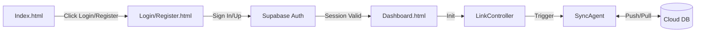

# RuneAI 系统架构蓝图 (Architecture Blueprint)

## 1. 核心设计哲学 (Core Philosophy)

RuneAI 遵循 **Yin-Yang Architecture**（阴阳架构）原则：

*   **Yin (阴 - 后端/数据层)**: 代表稳定性、数据完整性、业务规则验证。
    *   **技术栈**: Supabase (PostgreSQL, Edge Functions), IndexedDB (Local Cache), StorageAdapter.
    *   **职责**: 数据持久化、权限校验、复杂计算、安全性。
*   **Yang (阳 - 前端/交互层)**: 代表创造力、用户体验、即时反馈。
    *   **技术栈**: Vanilla JS (ES Modules), Tailwind CSS, HTML5.
    *   **职责**: UI 渲染、交互动画、本地状态管理、用户意图捕获。

## 2. 系统上下文 (System Context)

```mermaid
graph TD
    User[用户] -->|交互| UI[前端 UI (Yang)]
    UI -->|事件| Controller[控制器/逻辑层]
    
    subgraph "Browser Client"
        Controller -->|读写| Adapter[Storage Adapter]
        Adapter -->|本地持久化| IDB[(IndexedDB)]
        Controller -->|调度| Scheduler[任务调度器]
        Scheduler -->|生成请求| AIService[AI Service]
    end
    
    subgraph "Cloud Infrastructure (Yin)"
        AIService -->|API 调用| EdgeFn[Supabase Edge Functions]
        EdgeFn -->|数据同步| PG[(Supabase Postgres)]
        EdgeFn -->|LLM 调用| OpenAI[External LLM API]
    end
```

## 3. 模块划分 (Module Breakdown)

### 3.1 前端表现层 (Presentation Layer) - Yang 层

**✅ 已完成模块 (Phase 1)**
*   **Templates**: 纯函数组件，返回 HTML 字符串
    *   ✅ `templates/card.js`: 链接卡片模板 (已完成)
    *   ✅ `templates/digestCard.js`: 摘要卡片模板 (已完成)
    *   ✅ `templates/ui-helpers.js`: UI 辅助函数 (已完成)

**🔄 待拆分模块 (Phase 2-3)**
*   **Entry**: `main.js` (应用引导，路由分发)
*   **Views**: 负责 DOM 渲染与事件绑定（拆分自 `dashboard.js`）
    *   🔄 `views/linksView.js`: 链接卡片列表、筛选、搜索
    *   🔄 `views/digestView.js`: 摘要日报视图、详情弹窗
    *   🔄 `views/modalView.js`: 模态框管理
    *   🔄 `views/sidebarView.js`: 侧边栏状态管理

**📋 设计原则 (Yang 层原则)**
*   **纯函数优先**: Templates 必须是纯函数（无副作用）
*   **事件委托**: Views 使用事件委托，避免直接 DOM 操作
*   **状态最小化**: 尽量将状态提升到 Controller 层
*   **响应式**: 支持主题切换、响应式布局
*   **动画流畅**: 使用 CSS 过渡，避免 JS 动画阻塞

### 3.2 业务逻辑层 (Logic Layer)
*   **Controllers**: 处理用户输入，协调 Model 与 View。
    *   `controllers/linkController.js`: 处理 CRUD、导入、校验。
    *   `controllers/digestController.js`: 处理手动生成、重试逻辑。
*   **Services**: 封装复杂业务或外部调用。
    *   `services/ai.js`: 统一 AI 摘要生成接口（Mock/Cloud 切换，统一返回 `{ ok, summary|error, metadata }`）。
        *   可测试性：提供测试钩子 `__setTestHooks({ mockAIFromUrl })` 用于单测注入依赖，避免路径 mock 与云端干扰。
    *   `services/scheduler.js`: 处理定时任务（自动日报生成）。

### 3.3 数据持久层 (Data Layer)
*   **Storage Adapter**: 统一数据访问接口（DAO 模式）。
    *   屏蔽底层存储细节（IndexedDB vs localStorage vs Cloud）。
    *   提供 `getLinks()`, `addDigest()` 等语义化方法。
*   **Database Wrapper**: `js/storage/db.js`
    *   IndexedDB 的底层封装，处理事务、索引、版本升级。

## 4. 数据流与安全边界 (Data Flow & Security)

### 4.1 关键数据流
1.  **用户添加链接**:
    UI (Input) -> Controller (Validate) -> Service (Fetch Meta) -> Adapter (Add) -> IndexedDB -> UI (Update)
2.  **生成摘要 (Manual/Daily)**:
    UI (Click) -> Controller (Check Quota) -> Service (AI Gen) -> Adapter (Save Digest & Log) -> IndexedDB -> UI (Update)

### 4.1.1 Phase 5 用户体验主流程（入口 → Auth → Sync → Dashboard）
- 入口（Landing）：`index.html` 提供“登录 / 注册”入口按钮，跳转 `login.html`。
- 登录（Login）：`login.html` 提供登录表单与 OAuth 入口；成功后跳转 `dashboard.html`。
- 注册（Register）：`register.html` 提供注册表单；注册后引导验证。
- 会话检查（Session）：`dashboard.html` 初始化时（`js/dashboard_init.js`）检查 Session，无效则重定向回 Login。
- 同步触发：登录成功或 Dashboard 加载时，调用 `linkController.initSyncAfterLogin()`，执行迁移与同步循环。
- 展示页：`dashboard.html` 渲染链接列表与用户信息（从 Session 恢复）。



### 4.2 安全边界 (Security Boundaries)
*   **前端验证 (Weak)**:
    *   `userId === 'local-dev'` 仅用于本地调试和 UI 展示控制。
    *   每日额度限制 (`LIMITS`) 在前端仅作为用户体验优化，防止误操作。
*   **后端验证 (Strong - Future)**:
    *   所有写入操作（`addLink`, `addDigest`）必须经过 Edge Function 验证。
    *   **API Key**: 存储在 Supabase Vault，前端不可见。
    *   **Rate Limiting**: 在 Edge Function 层进行 IP/User 级别的限流。
    *   **Row Level Security (RLS)**: 数据库层强制执行 `user_id` 隔离。

## 4.3 Phase 5 更新（2025-12-08）

- 初始化入口重构：
  - 新增 `src/js/dashboard_init.js` 作为 Dashboard 页面单一入口，加载即执行自调用函数。
  - 行为：检测 Dev/Mock 模式 → 恢复/注入本地用户 → 检查 Supabase Session → 未登录统一重定向 `login.html`。
  - 完成后调用 `features/dashboard.initDashboard()` 初始化各视图模块。

- Links 视图与交互增强：
  - 将全局右上角 `Add Link` 按钮移入 All Links 区域并替代原标题；新按钮 id：`#addLinkBtnHeader`，旧按钮保留并默认隐藏 `global-add-link--hidden` 以便回滚。
  - 在非 `All Links` 分类的列表末尾渲染“+”卡片（类名：`.rune-card-add`），点击打开 `#selectLinkModal`，用户可从现有链接中选择并加入当前分类。
  - 复用 `services/uiService.openAddLinkModal()` 打开新增链接模态框，确保一致的无障碍与焦点管理。

- 关键模块关系：
  - `features/dashboard.js` 初始化 `views/linksView.js` 与 `views/digestView.js`，并订阅 `storageAdapter` 的变更事件以刷新视图。
  - `views/linksView.js` 负责列表渲染与事件绑定：`filterCardsByCategory()`、`bindSelectLinkModalEvents()`、`bindModalEvents()`。
  - `controllers/linkController.js` 提供 CRUD 与同步触发；`updateLink()` 支持加入分类的更新。

> 注：本次更新统一未登录守卫跳转至 `login.html`，与登出行为保持一致；在 Dev/Mock 模式下注入 `local-dev` 用户以简化本地联调。

## 5. 短期行动清单 (接下来 4 周)

| 优先级 | 任务 (Issue) | 描述 | Owner | 状态 |
| :--- | :--- | :--- | :--- | :--- |
| **P0** | **FIX-001** | 修复 ID 类型兼容性与错误处理 (Generate/Subscribe/Delete) | Solo | ✅ Done |
| **P0** | **FIX-002** | 持久化冷却状态 (Cooldown Persistence) | Solo | ✅ Done |
| **P1** | **FEAT-001** | 明确区分 Manual vs Daily 摘要生成逻辑 | Solo | ✅ Done |
| **P1** | **REFACTOR-001** | 提取 `constants.js` 并消除硬编码字符串 | Solo | ✅ Done |
| **P2** | **REFACTOR-002** | **将摘要生成逻辑统一迁移至 `ai.js`** (消除 Dashboard 重复代码) | Solo | 🔄 In Progress |
| **P2** | **ARCH-001** | **拆分 `dashboard.js` - 第一阶段 (提取 Templates)** | Solo | ✅ **Completed** |
| **P2** | **ARCH-002** | **拆分 `dashboard.js` - 第二阶段 (提取 Controllers)** | Solo | 📋 Ready |
| **P3** | **PERF-001** | 为 Links 列表实现分页加载 (IndexedDB 游标) | Solo | To Do |

## 附录 · Auth 与 SW 更新（2025-12-04）
- Auth UI：`login.html` / `register.html` 采用 **手动事件绑定**（按钮 `type="button"`），避免默认表单提交导致 URL 泄露与刷新。
- 状态监听：`supabase.auth.onAuthStateChange` 负责跳转与同步触发；登录成功兜底调用 `handleLoginSuccess()`。
- SW 策略：`sw.js` 对 HTML 请求采用 **Network First**，确保页面始终最新，避免缓存旧页面带来的交互问题。

## 6. Web Digest 推送架构（新增）

### 6.1 数据表
- `public.digests`：摘要内容与状态（`pending/success/failed`）。
- `public.send_queue`：发送队列（`queued/processing/done/failed`、`attempt`、`next_try`）。
- `public.send_logs`：发送日志（`channel/target/status/response/created_at`）。

### 6.2 Edge Functions
- `generate-digest`：生成摘要并按规则入队。
- `list-digests`：分页与日期查询摘要。
- `enqueue-send`：将指定摘要入队。
- `send-worker`：每 1 分钟批处理队列，发送到 Telegram，写入日志并更新状态。

### 6.3 安全与合规
- 所有接口强制 `Authorization: Bearer <JWT>` 并进行 `supabase.auth.getUser(jwt)` 校验。
- RLS：所有表按 `user_id = auth.uid()` 进行行级隔离。
- 退订文案：消息内包含退订说明；订阅表记录 `consent_at`。

### 6.4 前端集成
- Digest 页面：新增 `Generate (Edge)`、卡片 `Preview` 与 `Send Now`。
- 订阅管理：频道选择（Telegram/WhatsApp/None）、目标填写（chat_id/phone）、退订与 consent 展示。
- 发送历史：展示 `send_logs` 并支持重试。
## 7. 计费与用户额度架构（新增）

### 7.1 数据表
- `public.app_settings`：全局默认每日额度（`default_daily_limit`）。
- `public.user_quotas`：用户自定义每日额度与一次性 `extra_credits`。
- `public.plans`：可售计划（一次性/订阅，`grant_amount` 与价格、Stripe Price ID）。
- `public.purchases`：购买记录（`pending/succeeded/failed/refunded`）。
- `public.stripe_events`：幂等事件记录（`event_id`）。

### 7.2 Edge Functions
- `set-quota`：管理员设置用户额度（校验 `admin` 角色）。
- `create-checkout-session`：创建 Stripe 结账会话（返回重定向 URL）。
- `stripe-webhook`：验证事件签名，入账发放额度与退款回退。
- `generate-digest`（更新）：按 `daily_limit + extra_credits - used_today` 计算剩余并限流。
- 事务函数（RPC）：
  - `apply_purchase_and_grant`：单事务写 `purchases` 并累加 `user_quotas`。
  - `generate_digest_with_quota`：行级锁 + 限额 + 插入摘要 + 必要扣减一次性额度。
  - `log_stripe_event`：`ON CONFLICT DO NOTHING` 幂等记录事件，返回是否新插入。

### 7.3 安全与 RLS
- 所有表启用 RLS；用户仅能读写自己（`auth.uid()`）。
- 管理动作与财务写入仅在后端函数执行，使用 Service Role 绕过 RLS。
- Webhook 实现幂等与退款回退；密钥仅存于函数环境变量。
- 事件追踪：`purchases` 保存 `stripe_event_id/stripe_session_id/payment_intent`，辅助审计回溯。

### 7.4.1 管理员角色配置（JWT Claims）
- 在 Supabase 控制台将管理员用户的 `app_metadata.role` 或 `user_metadata.role` 设置为 `admin`。
- RLS 策略通过 `current_setting('jwt.claims.role', true) = 'admin'` 判断权限。

### 7.4 前端集成
- `My Quota`：展示额度与购买入口（计划列表 + 跳转结账）。
- `Admin Billing`：设置用户每日/额外额度。
- 服务封装：`billing_service.js`；控制器：`billing_controller.js`。
