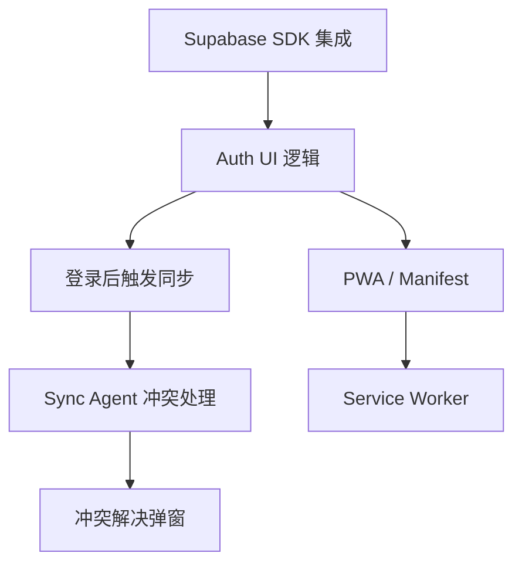

# Phase 5 Master Plan: Harmony & Experience

> **版本**: v1.0 (Unified)
> **状态**: In Progress
> **目标**: 补齐前端交互短板，实现 Auth UI、冲突解决界面与 PWA 离线能力，达成端到端“和谐”体验。

## 1. 当前系统状态 (System Status)

本项目已完成 **Phase 3 (性能优化)** 与 **Phase 4 (云端同步架构)**。

*   **✅ 已就绪能力**:
    *   **高性能渲染**: 虚拟滚动、增量更新、图片懒加载。
    *   **云端基础设施**: Supabase (PostgreSQL, Edge Functions) 已部署。
    *   **同步引擎**: 基于 RPC (`apply_client_changes`) 的事务性同步已跑通。
    *   **数据安全**: RLS 策略已部署，Edge Functions 具备 JWT 校验能力。

*   **🚧 待补齐短板 (Phase 5 Focus)**:
    *   **Auth UI**: 目前依赖 Mock 或手动 Token，缺乏面向用户的登录/注册界面。
    *   **冲突解决**: 冲突发生时仅在日志记录，缺乏 UI 让用户决策。
    *   **离线体验**: 缺乏 Service Worker，断网无法加载 App Shell。

## 2. Phase 5 任务全景图 (The Plan)

### Milestone 5.1: 身份之门 (Auth UI & Logic) - **Priority: P0**
**核心目标**: 引入 Supabase SDK，接管身份认证流程。

*   **TASK-P5-001**: **SDK 集成**
    *   在 `index.html` 引入 `@supabase/supabase-js` (CDN)。
    *   重构 `js/services/supabaseClient.js`，使用 SDK 替代手动 Fetch。
*   **TASK-P5-002**: **UI 逻辑实现**
    *   创建 `js/features/auth_ui.js`。
    *   实现登录 (Sign In)、注册 (Sign Up)、退出 (Sign Out) 的表单事件处理。
    *   处理 Auth 状态变更监听 (`onAuthStateChange`)。
*   **TASK-P5-003**: **同步联动**
    *   登录成功后，自动触发 `initSyncAfterLogin()`，将本地匿名数据合并/迁移至云端账户。

### Milestone 5.2: 冲突之舞 (Conflict Resolution) - **Priority: P1**
**核心目标**: 赋予用户解决数据冲突的权利。

*   **TASK-P5-004**: **冲突弹窗组件**
    *   开发 `js/components/modal-conflict.js`。
    *   UI 展示：Local Version vs Server Version (Diff View)。
    *   操作：`Keep Local` (Force Push) / `Keep Server` (Overwrite Local)。
*   **TASK-P5-005**: **Sync Agent 接入**
    *   改造 `js/sync/syncAgent.js`。
    *   当 RPC 返回 `conflicts` 数组时，暂停同步队列。
    *   唤起冲突弹窗，根据用户选择生成修正后的变更操作。

### Milestone 5.3: 离线之根 (PWA & Offline) - **Priority: P2**
**核心目标**: 断网环境下应用秒开。

*   **TASK-P5-006**: **Manifest 配置**
    *   添加 `manifest.json`，配置图标、名称、主题色。
*   **TASK-P5-007**: **Service Worker**
    *   编写 `sw.js`，缓存 App Shell (HTML, CSS, JS Core)。
    *   在 `js/main.js` 中注册 SW。

## 3. 任务依赖图 (Dependency Graph)

*   **关键路径**: SDK -> Auth UI -> Sync Trigger -> Conflict Logic。
*   **并行路径**: PWA 相关任务可与 Conflict 任务并行开发。

## 4. 完成标准 (Acceptance Criteria)

1.  **身份认证**:
    *   用户可注册新账号，或登录已有账号。
    *   JWT Token 自动持久化，页面刷新后保持登录状态。
    *   Token 过期后 SDK 自动刷新，或引导用户重新登录。
2.  **数据同步**:
    *   **登录即同步**: 登录后，本地数据自动上传并与云端合并。
    *   **冲突解决**: 在两端同时修改同一数据场景下，前端能弹出对话框，用户选择后数据最终一致。
3.  **离线能力**:
    *   Chrome DevTools Network 设为 Offline 时，刷新页面不报错，能看到 Dashboard 骨架和缓存数据。

## 5. 风险与解决方案 (Risks & Solutions)

| 风险点 | 解决方案 |
| :--- | :--- |
| **SDK 体积过大** | 使用 CDN 引入，且利用浏览器缓存；仅引入必要的 Auth 模块（如可行）。 |
| **数据合并丢失** | 采用保守策略：冲突时默认不覆盖，必须用户确认；Sync Push 采用事务回滚。 |
| **RLS 权限泄露** | 后端 RLS 强制检查 `auth.uid()`，确保即使用户伪造前端请求也无法访问他人数据。 |
| **离线缓存更新** | Service Worker 采用 "Network First" 或 "Stale While Revalidate" 策略，确保代码更新能及时生效。 |

## 6. 对下一阶段 (Phase 6) 的影响

Phase 5 完成后，系统将具备完整的用户账户体系和多端同步能力。Phase 6 将聚焦于：
*   **AI 增强**: 利用 Edge Functions 对接 LLM，实现真正的智能摘要生成。
*   **多语言完善**: 补全 i18n 覆盖率。
*   **分享与协作**: 基于 Auth 体系实现书签分享功能。
