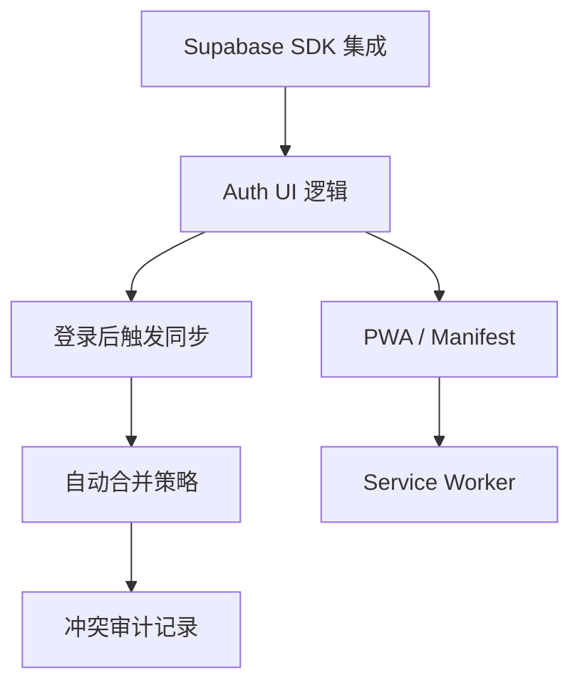

# Phase 5 Master Plan: Harmony & Experience

> **版本**: v1.1 (Unified & Updated)
> **状态**: In Progress
> **目标**: 补齐前端交互短板，实现 Auth UI、冲突解决界面与 PWA 离线能力，达成端到端“和谐”体验。

## 1. 当前系统状态 (System Status)

本项目已完成 **Phase 3 (性能优化)** 与 **Phase 4 (云端同步架构)**。

*   **✅ 已就绪能力**:
    *   **高性能渲染**: 虚拟滚动、增量更新、图片懒加载。
    *   **云端基础设施**: Supabase (PostgreSQL, Edge Functions) 已部署。
    *   **同步引擎**: 基于 RPC (`apply_client_changes`) 的事务性同步已跑通。
    *   **数据安全**: RLS 策略已部署，Edge Functions 具备 JWT 校验能力。
    *   **身份认证**: `@supabase/supabase-js` SDK 已集成，登录/注册 UI 已实现并联动同步。
    *   **自动合并**: 字段级 LWW 策略与 Tombstone 删除已落地。

*   **🚧 待补齐短板 (Phase 5 Focus)**:
    *   **离线体验**: 缺乏 Service Worker，断网无法加载 App Shell。
    *   **审计查看**: 虽然本地记录了冲突备份，但尚未提供 UI 查看。

## 2. Phase 5 任务全景图 (The Plan)

### Milestone 5.1: 身份之门 (Auth UI & Logic) - **Priority: P0** (✅ Completed)
**核心目标**: 引入 Supabase SDK，接管身份认证流程。

*   **TASK-P5-001**: **SDK 集成** (✅ Done)
    *   在 `index.html` 引入 `@supabase/supabase-js` (CDN)。
    *   重构 `js/services/supabaseClient.js`，使用 SDK 替代手动 Fetch。
*   **TASK-P5-002**: **UI 逻辑实现** (✅ Done)
    *   创建 `js/features/auth_ui.js`。
    *   实现登录 (Sign In)、注册 (Sign Up)、退出 (Sign Out) 的表单事件处理。
    *   处理 Auth 状态变更监听 (`onAuthStateChange`)。
*   **TASK-P5-003**: **同步联动** (✅ Done)
    *   登录成功后，自动触发 `initSyncAfterLogin()`，将本地匿名数据合并/迁移至云端账户。

### Milestone 5.2: 冲突之舞 (Conflict Resolution) - **Priority: P1** (✅ Completed)
**核心目标**: 优雅解决多端数据冲突，无需用户频繁介入。

*   **TASK-P5-007**: **自动合并与安全删除** (✅ Done)
    *   **策略**: 字段级 Last-Write-Wins (LWW)。
    *   **删除**: Tombstone (软删除) + Backup。
    *   **UI**: 非阻断 Toast 通知，冲突历史仅在后台记录。
    *   **RPC**: 升级 `apply_client_changes` 支持 `field_timestamps`。

### Milestone 5.3: 离线之根 (PWA & Offline) - **Priority: P2** (✅ Completed)
**核心目标**: 断网环境下应用秒开。

*   **TASK-P5-006**: **Manifest 配置** (✅ Done)
    *   添加 `manifest.json`，配置图标、名称、主题色。
*   **TASK-P5-008**: **Service Worker** (✅ Done)
    *   编写 `sw.js`，缓存 App Shell (HTML, CSS, JS Core)。
    *   在 `js/main.js` 中注册 SW。

## 3. 任务依赖图 (Dependency Graph)

## 4. 完成标准 (Acceptance Criteria)

1.  **身份认证**:
    *   用户可注册新账号，或登录已有账号。
    *   JWT Token 自动持久化，页面刷新后保持登录状态。
2.  **数据同步**:
    *   **登录即同步**: 登录后，本地数据自动上传并与云端合并。
    *   **冲突自动解决**: 多端修改不同字段自动合并；修改同字段取最新值并备份旧值。
3.  **离线能力**:
    *   Chrome DevTools Network 设为 Offline 时，刷新页面不报错，能看到 Dashboard 骨架和缓存数据。

## 5. 风险与解决方案 (Risks & Solutions)

| 风险点 | 解决方案 |
| :--- | :--- |
| **数据合并丢失** | 采用字段级 LWW + 冲突备份 (Conflict Backups) 表，确保任何被覆盖的数据都有迹可循。 |
| **离线删除冲突** | 引入 Tombstone 机制，仅当删除操作时间戳晚于所有字段更新时才生效，否则保留数据并记录冲突。 |
| **离线缓存更新** | Service Worker 采用 "Network First" 或 "Stale While Revalidate" 策略。 |

## 6. 对下一阶段 (Phase 6) 的影响

Phase 5 完成后，系统将具备完整的用户账户体系和多端同步能力。Phase 6 将聚焦于：
*   **AI 增强**: 利用 Edge Functions 对接 LLM，实现真正的智能摘要生成。
*   **多语言完善**: 补全 i18n 覆盖率。
*   **管理后台**: 提供界面查看 `conflict_backups` 和 `deletion_backups`，支持数据恢复。
